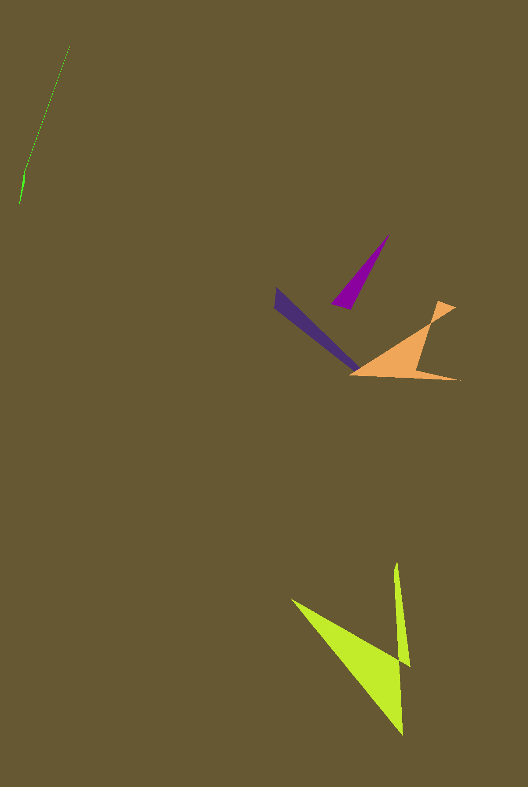
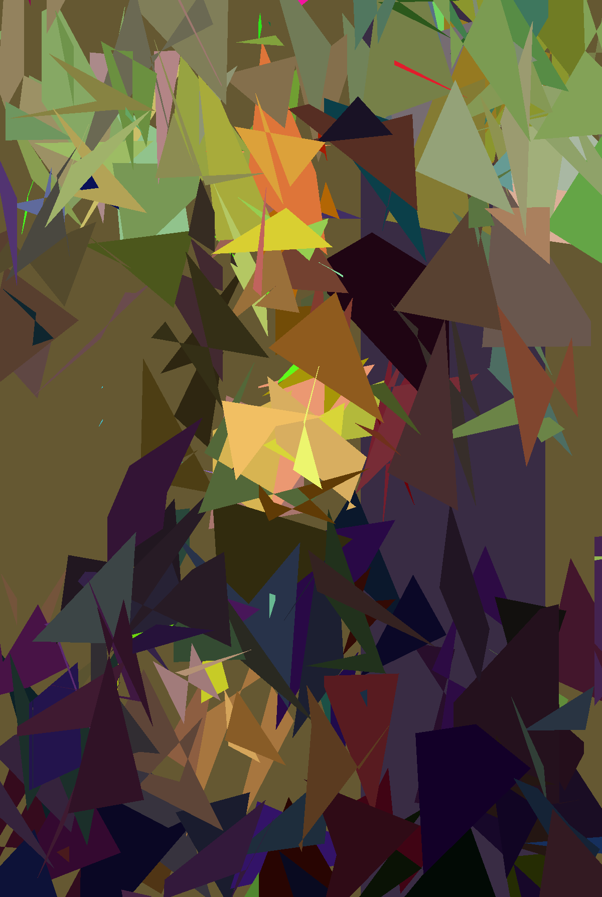
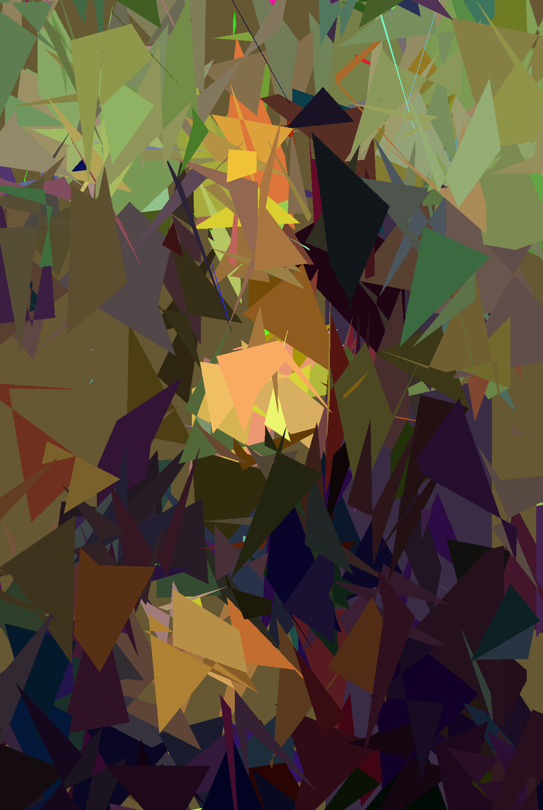
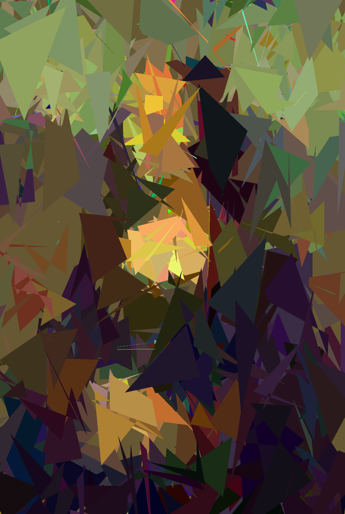
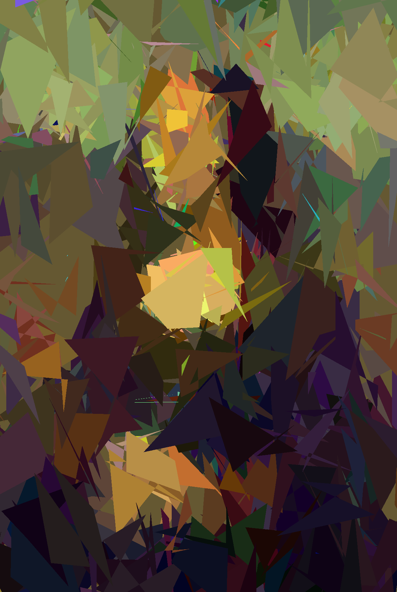

# Code da Vinci: Image Reconstruction using Genetic Algorithm

## Introduction

This project is a simple implementation of a genetic algorithm to recreate an image using polygons and uses a parallel processing for optimization.

## Approach

Based on the [article](https://medium.com/@sebastian.charmot/genetic-algorithm-for-image-recreation-4ca546454aaa) by Sebastian Charmot.

The algorithm is based on the following steps:

1. Generate a random population of polygons
2. Compute the fitness of each individual
3. Select the best individual
4. Apply crossover between the best individual and the population (with stocking the previous best individual)
5. Apply mutation to the population (except the previous best individual), which consists in adding a random polygon to all individuals
6. Repeat from step 2, x times to upgrade the image

## Results

The result of this different steps are shown below.
| image | 0 generations | 250 generations | 500 generations | 750 generations | 1000 generations |
| --- | --- | --- | --- | --- | --- |
|  |  |  |  |  |  |

## Reference:
1. https://github.com/nathan-hoche/MonaLisa
2. https://users.cg.tuwien.ac.at/zsolnai/gfx/mona_lisa_parallel_genetic_algorithm/
